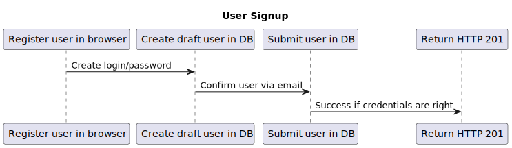

Azure:

GitHub Pages:

# Home Expenses App

## Table of contents

- [Quick Start](#quick-start)
- [Development](#development)
  - [Local Setup](#local-setup)
    - [Backend](#backend)
    - [Frontend](#frontend)
  - [Deploy to Azure](#deploy-to-azure)
    - [Backend Azure](#backend-azure)
    - [Frontend Azure](#frontend-azure)
  - [Certificates](#certificates)
  - [Testing](#testing)
- [Documentation](#documentation)
- [Swagger](#swagger)
- [Architecture](#architecture)
  - [Sending Mail Service](#sending-mail-service)
    - [User Signup](#user-signup)
    - [User Signin](#user-signin)

---

### Quick start

### Development

#### Local Setup

##### Backend

1. Install java 17
2. Set environment variable `JAVA_HOME` to java folder (Example for Windows: `C:\Program Files\Java\jdk-17`)
3. Add `%JAVA_HOME\bin` to `PATH` variable
4. For local running use the command `./gradlew bootRun` and check url: `localhost:8080/api`

##### Frontend

1. Install nodejs version 18.14.0 from [here](https://nodejs.org/download/release/v18.14.0/)
   - You can try the latest version, but there is no guaranty that it will work properly
   - This project runs on `node` v18.14.0 and `npm` v9.3.1 and uses `angular-cli` v15
2. Edit your `\etc\hosts` (`C:\Windows\System32\drivers\etc\hosts`) file to include the following line: `127.0.0.1 local.home-expenses.com`
3. For local running open command line and execute following commands:
   - go to `code/frontend/home-expenses-ui` folder
   - Run `npm i`
   - Run `npm start`
4. Navigate to: `https://local.home-expenses.com:8443`

#### Deploy to Azure

##### Backend Azure

- OPTION 1 (Azure CLI):
  - Install Azure CLI using the following link: https://learn.microsoft.com/en-us/cli/azure/install-azure-cli-windows
  - Run `az -v` for checking version
  - Run `az login` and provide Azure credentials in the browser
  - Run `./gradlew azureWebAppDeploy` from `code/backend/home-expenses-service` folder
- OPTION 2 (pushing change to `main`)
  - push new change to `main` branch for triggering [Build & Deploy BACKEND on Azure](https://github.com/home-expenses-github-username/home-expenses/actions/workflows/build-backend-azure.yml)
- OPTION 3 (triggering GitHub action)
  - manually trigger [Build & Deploy BACKEND on Azure](https://github.com/home-expenses-github-username/home-expenses/actions/workflows/build-backend-azure.yml)
- Navigate to: `https://home-expenses-backend.azurewebsites.net/api`

##### Frontend Azure

You can deploy frontend app on two places: GitHub pages and Azure

- GitHub: [Build & Deploy UI on Github Pages](https://github.com/home-expenses-github-username/home-expenses/actions/workflows/build-ui-ghpages.yml)
  - there is no backend here
- Azure: [Build & Deploy UI on Azure](https://github.com/home-expenses-github-username/home-expenses/actions/workflows/build-ui-azure.yml)
  - the entire solution: backend and frontend setup on Azure

1. Pushing change to `main` (the change inside `code/frontend/home-expenses-ui` folder) will trigger both actions:
   - [Build & Deploy UI on Github Pages](https://github.com/home-expenses-github-username/home-expenses/actions/workflows/build-ui-ghpages.yml)
   - [Build & Deploy UI on Azure](https://github.com/home-expenses-github-username/home-expenses/actions/workflows/build-ui-azure.yml)
2. Or trigger manually one of the above:
3. Navigate to: `https://yellow-bush-03266d003.2.azurestaticapps.net`

#### Certificates

#### Testing

### Documentation

- Adding Database: https://learn.microsoft.com/en-us/azure/azure-sql/database/single-database-create-quickstart?view=azuresql&tabs=azure-portal

### Swagger
- [Swagger API](https://home-expenses-auth.azurewebsites.net/api)

### Architecture

#### Sending Mail Service

##### User Signup

##### User Signin

